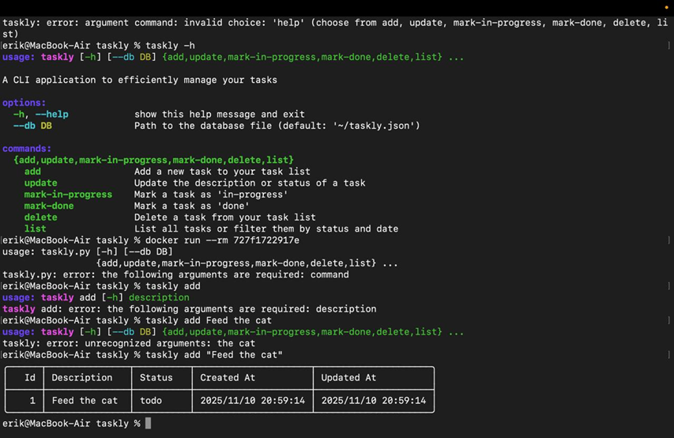

# Лабораторная работа 2.

## Часть 1 - Dockerfile
Мы скачали CLI таск трекер taskly
и сделали докерфайл на основе него. 




```
FROM python:3.12-slim
RUN useradd -m appuser
USER appuser
WORKDIR /app
COPY pyproject.toml ./
RUN pip install .

COPY . .
CMD ["python", "taskly.py"]
```

На основе этого нормального докерфайла мы сделали вот этот убогий докерфайл:

```
FROM python:3.12

COPY pyproject.toml ./
RUN pip install .

COPY . .
CMD ["python", "taskly.py"]
```
В нём были намеренно введены следующие глупости:

1 - В докерфайле не указан пользователь, поэтому используется root по умолчанию. Если смонтировать контейнер, то он сможет просматривать и редактировать файлы хоста, к кот. он получил доступ. 

2 - В докерфайле скачивается весь Python целиком, из-за чего время сборки увеличивается в три раза. 


3 - В докерфайле не прописана рабочая директория, поэтому данные будут храниться там же, где зависимости, нужные для сборки контейнера — это затрудняет навигацию. Навигация осложнится еще сильнее, если в контейнере будет несколько приложений одновременно.


## Часть 2 - Плохие практики по работе с контейнерами

1 - хранение данных, особенно ценных, внутри контейнера. Хранить ценные данные в работающем контейнере и не дублировать их, например, в Docker Volumes - плохая идея, потому что данные будут безвозвратно потеряны с закрытием контейнера.

2 - использование одного контейнера для совсем разных задач. Например, нельзя допускать ситуацию, когда один и тот же докерфайл используется в проде и в тестовой среде.
Наличие всякого мусора и артефактов разработки в контейнерах может негативно сказаться на безопасности и стабильности работы.
