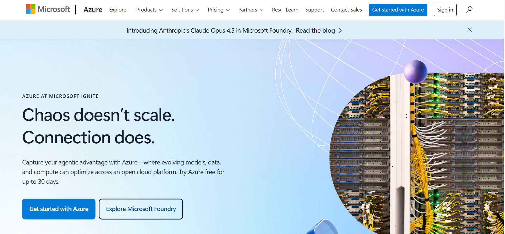
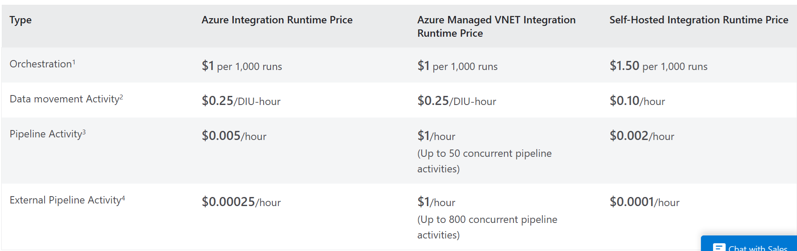

# Лабораторная работа №2, вариант 10.

## Цель работы

Получение навыков аналитики и понимания спектра публичных облачных сервисов без привязки к вендору. Формирование у студентов комплексного видения Облака.

## Ход работы

Используя знания, выработанные при выполнении Лабораторной работы №1, мы быстро смогли найти системы ценообразования на сайтах Microsoft. 
Основной сайт, который мы использовали для большинства сервисов - https://azure.microsoft.com/en-us.

---
## Сервисы

1) Microsoft Azure Database for MySQL - сервис для выполнения SQL-запросов на базах данных. 

2) Microsoft Azure Databricks

3) Microsoft Viva Insights

4) Microsoft Azure Resource Manager

5) Microsoft Azure Data Factory

6) Microsoft Azure Data Lake Storage

7) Microsoft Azure Stream Analytics

8) Microsoft Azure Cache for Redis

9) Azure CDN

10) Compute Job Scheduling 

11) Azure Virtual Machines
